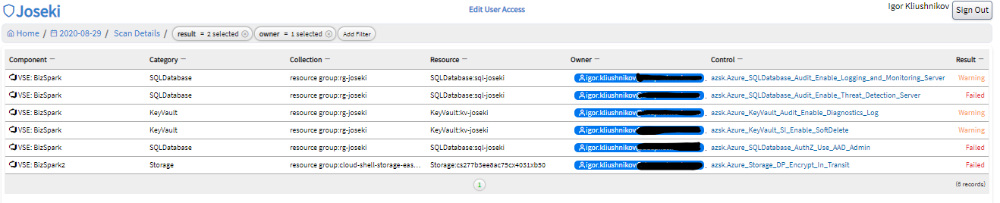

# Joseki

- [Joseki](#joseki)
  - [Joseki web-portal](#joseki-web-portal)
  - [Architecture](#architecture)
  - [Installation](#installation)
  - [Feedback](#feedback)
  - [FAQ](#faq)

*Joseki* is a set of services to help you keeping cloud-infrastructure, kubernetes and docker-images configuration closer to known best-practices.

At the moment, the project integrates three open-sourced tools:

- Container Image vulnerabilities scanner [trivy](https://github.com/aquasecurity/trivy).
- Kubernetes objects validator [polaris](https://github.com/FairwindsOps/polaris).
- Azure Cloud infrastructure auditor [az-sk](https://github.com/azsk/DevOpsKit)

More information about product motivation, what it is, and roadmap is at the [Product overview](/PRODUCTOVERVIEW.md) document.

## Joseki web-portal

Joseki web application provides a visual overview of the audited infrastructure:

- a summary of the overall infrastructure state at any given date
  
- comparison of a single infrastructure component state at two given dates
  
- docker image scan overview
  
- filterable table with all check results for a given date
  
- check-results history, component-details pages for each separate infrastructure component, and others.

## Architecture

`Joseki` consists of three main parts:

- `frontend` - a web application, which interacts with end-user;
- `backend` - exposes web-api for `frontend` and does the most of business logic: shaping audit data, historical view, reporting, configuration.
- `scanners` - a set of applications (one per audit/scan type), that once in a while perform audit/scan operation and uploads raw results to a Blob Storage.

The first version of `Joseki` works with `trivy`, `polaris`, `azsk` scanners, and consumes Azure-hosted components:

More technical details you could find in the [Technical design](./TECH_DESIGN.md) document.

## Installation

To install the application to your environment, please follow the [Deployment guide](./DEPLOYMENT.md).

## Feedback

The project is still in its early days, and users should consider it as a _proof-of-concept_ solution rather than _production-ready_.

We would :heart: to hear your feedback! Do not hesitate to open new issues, leave comments to existing ones, or contact us via `joseki@deepnetwork.com`

## FAQ

### Could I use Joseki in CI/CD pipeline?

Unfortunately, not. Joseki's task  is to reveal the actual state of the system and compare it over time. For CI/CD, we would suggest looking at scanners itself: [polaris](https://github.com/FairwindsOps/polaris/blob/master/docs/usage.md#running-with-cicd), [trivy](https://github.com/aquasecurity/trivy#continuous-integration-ci), [azsk](https://github.com/azsk/DevOpsKit-docs/blob/master/03-Security-In-CICD/Readme.md).

### Where can I find raw audit results?

Once a `scanner` completed the audit/scan task - it uploads results to `Blob Storage`. When  `backend` finished processing raw results - it moves files to _Archive_.

Scanners follow the `/{scanner-type}-{scanner-id-short-hash}/{audit-date}-{hash}/{audit_files}` pattern to create audit folders. For example:

### I do not see audit results at web-portal

Results might _get lost_, in two places:

- `scanner` failed to perform the audit itself. To check it, take a look at scanner logs;
- `backend` failed to parse scan results. In such a case, dive into `backend` logs for clues.

Also, you can check raw audit results at blob storage. `meta` file in the audit folder describes the result of the audit: _failed_, _succeeded_, and the scan related metadata.
