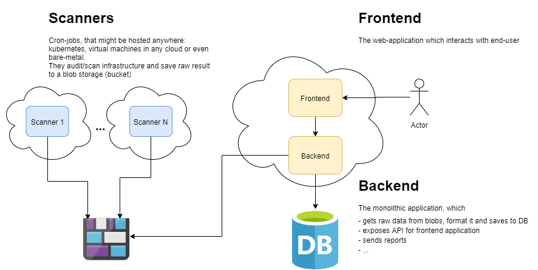

# Kubegaard

- [Kubegaard](#kubegaard)
  - [Motivation](#motivation)
  - [Features](#features)
    - [Integrates multiple *scanner* types](#integrates-multiple-scanner-types)
    - [Historical data](#historical-data)
    - [Reporting](#reporting)
    - [Create follow-up tasks based on checks results](#create-follow-up-tasks-based-on-checks-results)
    - [Real-time configuration](#real-time-configuration)
    - [User Interface](#user-interface)
  - [Technical Design](#technical-design)
    - [Easy to start, but customizable](#easy-to-start-but-customizable)
    - [Components](#components)
      - [Scanners](#scanners)
      - [Backend](#backend)
      - [Frontend](#frontend)
      - [Infrastructure](#infrastructure)
      - [Inter-service communication](#inter-service-communication)
        - [Frontend and Backend](#frontend-and-backend)
        - [Backend and Scanners](#backend-and-scanners)
    - [Technologies](#technologies)
  - [Development process](#development-process)
    - [Single repository](#single-repository)
    - [Ready to run at any commit in master](#ready-to-run-at-any-commit-in-master)
    - [Getting Started examples](#getting-started-examples)
    - [CI/CD](#cicd)

## Motivation

Security is a massive and complicated topic, but there are dozens of open sourced tools on the market that can help to make a product safer. The tools often are summoned to force known best-practices to docker images, containers, infrastructure.

Unfortunately, there are problems:

- a lot of tools cover just a single aspect of security management
- also they are disconnected and just figuring out how to use them together is a hassle
- often, they have no reporting capabilities,
- and no historical overview.

## Features

*Kubegaard* is expected to have the following features

### Integrates multiple *scanner* types

- Container Image vulnerabilities scanners. For example, [trivy](https://github.com/aquasecurity/trivy), [clair](https://github.com/quay/clair).
- Kubernetes objects validators. For example, [polaris](https://github.com/FairwindsOps/polaris), [cluster-lint](https://github.com/digitalocean/clusterlint).
- Kubernetes cluster configuration validation. For example, [kube-bench.](https://github.com/aquasecurity/kube-bench) [kube-hunter](https://github.com/aquasecurity/kube-hunter)
- Kubernetes anomaly detectors. For example, [falco](https://github.com/falcosecurity/falco)
- Cloud infrastructure auditors. For example, [az-sk](https://github.com/azsk/DevOpsKit), [cloud-sploit](https://github.com/cloudsploit), [scout-suite](https://github.com/nccgroup/ScoutSuite), [security-monkey](https://github.com/Netflix/security_monkey).
- Web application scanners. For example, [ZAProxy](https://github.com/zaproxy/zaproxy)

### Historical data

- Persisting all scan results according to a defined retention period
- Providing read interface to historical data

### Reporting

- send reports via email, webhooks, slack, ms-teams, and others.
- multiple report types:
  - the current state of the system,
  - diff from the last report,
  - include only subset of scanners to report on.
- expose a subset of data as metrics (well-known grafana dashboards, alerting)

### Create follow-up tasks based on checks results

- Jira/Azure DevOps tasks
- emails/slack/...

### Real-time configuration

- enable/disable security check:

  - for the whole solution
  - for a subset of objects (tolerations) based on scanned object metadata
  - suppress a check for a period (for a week, month, etc)
- creating new security checks (likely, [Open Policy Agent](https://www.openpolicyagent.org/) integration)
- enable/disable scanner types (image, k8s-objects, k8s, cloud)
- reports management: define report types and schedules, download existing reports
- create follow-up tasks based on audit results
- RBAC

### User Interface

- interactive dashboards
  - cloud view
  - kubernetes view
  - vm/container-image issues
- web-interface to manage all listed features: configuration, follow-up tasks, reporting

## Technical Design

*Kubegaard* should:

- integrate multiple security/configuration related products under a common umbrella

- provide hierarchical scan/audit results:

  - a set of *cloud-infrastructure* audits
  - some products in the *cloud-infrastructure* might have *product-specific* scanners (kubernetes cluster, virtual-machines, etc)
  - *kubernetes audit* might consist of *cluster-configuration* and *object-metadata* audits
  - *virtual-machine scan* can have a set of *docker-container* scans
  - object with associated public-ip (vm, k8s-service) might be scanned with zaproxy.

  Sample hierarchy:

  ```text
  - az-subscription-1
    - vm-1
      - configuration audit
      - packages scan
      - container-1 image scan result
      - container-2 image scan result
    - vm-2
      ...
    - AKS-1
      - k8s-objects audit
        - pod-1
          - image scan result
          - config audit
        - pod-2
        ...
      - k8s-cluster audit
      - service-1 zaproxy scan
    - AKS-2
      ...
  - az-subscription-2
    ...
  ```

- provide extensibility points for adding new

  - scanners
  - persistence layer to store historical data and *Kubegaard* configuration
  - reporting destinations
  - task-tracking integrations

### Easy to start, but customizable

When a new user starts working with *Kubegaard*, the application needs to *just work*, but once it works, it needs to be fully customizable and fully adaptable.

Therefore, each service should be able to run with good-enough defaults, but also be flexible to change these defaults by experienced user.

### Components

*Kubegaard* consists of three main parts:

- `frontend` - a web application, which interacts with end-user;
- `backend` - expose web-api for `frontend` and does the most of business logic: shaping audit data, historical view, reporting, configuration. To simplify the first phase of development, the entire backend is created as a single service.
- `scanners` - a set of applications (one per audit/scan type), that once in a while perform audit/scan operation and saves raw results to a common blob-storage. Each scanner job can be deployed to different locations: cloud or bare-metal; VMs, kubernetes or [ACI](https://azure.microsoft.com/en-us/services/container-instances/)/[Cloud Run](https://cloud.google.com/run/)/[Fargate](https://aws.amazon.com/fargate/); FaaS.



#### Scanners

**Scanners** are independent short-lived applications, that perform a single infrastructure audit.

Each scanner lifecycle is similar to the following:

- being scheduled to a particular compute resources (VM, k8s, FaaS). Scheduling might happen according to user-defined schedule (cron) or triggered by event (message in a queue);
- read target (k8s, cloud resources, docker-image) configuration;
- validates target configuration;
- writes audit results to a **Messaging Service**.

Detailed scanners technical design is located next to scanner sources: `/src/scanners/{scanner-type}/README.md`, where `{scanner-type}` is one of `trivy`, `polaris`, `az-sk`, `kube-bench`.

#### Backend

**Backend** - is monolithic application, which encapsulate the most of *Kubegaard* business logic:

- audit data normalization,
- house-keeping the configuration,
- API for Frontend,
- reporting
- third-party integrations

It exposes API for `Frontend` application and asynchronously communicates with `Scanners` through **Messaging Queue**.

The application is hosted as docker-container and gets own configuration through `settings.json` file and environment variables.

Detailed technical design is described in [backend technical design](./src/backend/TECH_DESIGN.md) document.

#### Frontend

`Frontend` is web application to interact with end-user. The application provides interactive dashboards, configuration panel for overall product settings, and others.

The application hosted in docker-container and gets own configuration from configuration file and environment variables.

Detailed technical design is described in [frontent technical design](./src/frontend/TECH_DESIGN.md) document.

#### Infrastructure

All the services are wrapped in docker-containers and could run on any infrastructure, which has container runtime.

`Backend` application requires a **Database** to persist:

- normalized scan/audit results;
- `Kubegaard` configuration
- reports metadata

`Backend` reads audit/scan results from **Messaging Service** and uploads raw audit/scan results to **Blob Storage**.

`Scanners` uses **Messaging Service** to publish audit/scan results to it and some of them might use it as trigger source.

#### Inter-service communication

There are two types of communication:

- `Frontend` and `Backend`;
- `Backend` and `Scanners`.

##### Frontend and Backend

`Frontend` application depends only on `Backend` REST API. The services communicates through HTTPs. At the moment, user authentication and authorization are not supported, but it's in [product roadmap](./ROADMAP.md).

Available API endpoints are described at `https://{scanners-url:port}/swagger`.

##### Backend and Scanners

`Backend` and `Scanners` asynchronously interact through **Messaging Service**:

- `Scanners` enqueue audit/scan results and own metadata in agreed format to the service;
- `Backend` dequeue messages, saves raw data to **Blob Storage** and normalized data to **Database**.

The message consists of headers and payload, where `headers` is a set of key-value pairs and `payload` is `base64` encoded json with scan/audit result:

```json
{
  "headers":{
    "auditId": "string",
    "timestamp": "data-time",
    "scanner-type": "string",
    "scanner-id": "string",
    "scanner-periodicity": "string",
    "payload-version": "string",
    "payload-chunks": "int", // if payload is too big to be transmitted with a single message, this property would have number > 1
    "payload-current-chunk": "int" // represents current message chunk
  },
  "payload": "base64-json" // scan/audit result might contain characters, that can corrupt message envelop or not unsupported by Messaging Service
}
```

Note, `payload-chunks` and `payload-current-chunk` helps to split huge message into parts as any **Messaging Service** might have own message-size limitations.

### Technologies

For initial implementation *Kubegaard* uses:

- [Vue.js](https://vuejs.org/) for **Frontend**;
- [dotnet core](https://github.com/dotnet/core) for **Backend**;
- `scanners` programming language/framework vary depending on a tool, which a scanner wraps;
- [Azure PostgreSQL](https://azure.microsoft.com/de-de/services/postgresql/) as **Database**;
- [Azure Blob Storage](https://azure.microsoft.com/en-us/services/storage/blobs/) as **Blob Storage**;
- [Azure Queue Storage](https://azure.microsoft.com/de-de/services/storage/queues/) as **Messaging Service**.

Service-level access to cloud dependencies is abstracted, therefore changing used products later should be possible.

The current choice is based on the most familiar products/framework of the dev-team at the moment of writing.

## Development process

The development process is optimized for a small team, and is focused on keeping sources at deployable state. Therefore, everything is stored in a single repository and pushes to `master` branch are permitted only through pull-requests, protected with ci-pipelines.

When project grows - the repository could be split according to service boundaries.

### Single repository

All the sources, documentation, getting-started samples are stored in the single repository:

- `.github` folder consists of pr-templates, issue-templates, github-actions pipelines.
- `examples` is a set of getting-started scripts/templates to deploy the solution as simple as possible
- `src` folder has four subfolders:
  - `backend`: web-api, data management, reporting, etc,
  - `frontend`: web-application,
  - `infrastructure`: templates/scripts to provision required infrastructure in misc clouds,
  - `scanners` has a dedicated sub-folder for each scanner type.
- `root` has project-level documents: [readme](./README.md), tech-design (this), [roadmap](./ROADMAP.md), [contributor guidelines](./CONTRIBUTING.md), and others

### Ready to run at any commit in master

Any commit in `master` branch should be in fully-functional state. To ensure this:

- the branch should be protected against direct pushes;
- all the changes should go through pull-requests;
- each PR should be validated with ci-pipeline.

### Getting Started examples

Getting Started examples is vital for the project - they should provide the easiest possible way to start using the application. Therefore, each example should:

- be in functional state (covered with acceptance tests?);
- has a readme explaining what exactly is deployed with it;
- explicitly say if the sample is production ready and if not what should be hardened.

If possible, each sample should has **a single script** to provision the solution.

### CI/CD

The repository has a set of continuous-integration pipelines to protect `master` branch from unsafe code and release trusted docker-images.

Logically, pipelines can be grouped into three categories:

1. _Pull Request_. They validate that code is safe to be merged: compile; run tests/analyzers/linters. Each job, service, infrastructure templates might have separate pipeline.
2. _Commit to `master`_. These pipelines main task is to publish ready-to-use docker images. Each job, service, infrastructure templates might have separate pipeline.
3. _Release_ - ensures getting-started samples are in working state, and creates Github release with pinned services versions.

*Continuous Delivery* pipeline, which deploys *Kubegaard* to the real infrastructure is out of this repository scope.
