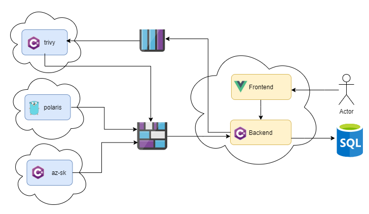

# V1 Technical Design

- [V1 Technical Design](#v1-technical-design)
  - [Problem definition](#problem-definition)
  - [Joseki Scope](#joseki-scope)
    - [Joseki Cornerstones](#joseki-cornerstones)
  - [Non-goals](#non-goals)
  - [Solution](#solution)
    - [Scanners](#scanners)
    - [Backend](#backend)
    - [Frontend](#frontend)
    - [Infrastructure](#infrastructure)
    - [Inter-service communication](#inter-service-communication)
      - [Frontend and Backend](#frontend-and-backend)
      - [Backend and Scanners](#backend-and-scanners)
    - [Technologies](#technologies)
      - [Supported Blob Storages](#supported-blob-storages)
        - [Azure Blob Storage](#azure-blob-storage)
      - [Supported Messaging Services](#supported-messaging-services)
        - [Azure Queue Storage](#azure-queue-storage)
  - [Considered but discarded alternatives](#considered-but-discarded-alternatives)
    - [All-in-one application](#all-in-one-application)
    - [Sending audit data directly to Joseki backend](#sending-audit-data-directly-to-joseki-backend)
    - [Sending normalized audit data from scanner apps](#sending-normalized-audit-data-from-scanner-apps)

|          |                  |
| -------- | ---------------- |
| Date:    | April 17th, 2020 |
| Status:  | Implemented      |
| Authors: | @v1r7u           |

## Problem definition

Security is a massive and complicated topic and there are dozens of open-sourced tools on the market that can help to make a product safer. The tools often are summoned to enforce known best-practices to docker images, kubernetes, and cloud infrastructure at large. However, this approach that relies on many tools comes up with its own set of problems:

- a lot of tools cover just a single aspect of security management
- tools are disconnected and just figuring out how to use them together is a hassle
- often, they have no reporting capabilities and no historical overview.

## Joseki Scope

Joseki is designed to **audit the configuration of cloud systems**. It combines various scanners to **target many object types**, reducing the number of tools needed to be learned, installed and maintained.

Joseki provides a graphical user interface, making it easier to consume and understand audit results. The results are **ranked based on severity** and each discovered issue is accompanied with a **recommended action** to resolve.

Joseki also offers **a historical view** and **reporting** to monitor the security of your systems over time and inform relevant parties from the state of affairs.

### Joseki Cornerstones

- *Scans* - scheduled configuration audits. Scan periods can be adjusted (e.g. daily, weekly, etc.)
- Audit different types of objects via different underlying scanners. These objects are:
  - azure cloud infrastructure: databases, networks, vendor-specific products.
  - k8s objects: deployment, statefulset, etc.
  - docker images.
- Rank all found issues based on their severity.
  - The user can override the severity of specific types of issues.
- Suggest remedies or solutions to discovered issues whenever possible.
  - Some problems may not have a solution at the moment. (e.g. a CVE that is recently discovered and is not yet addressed)
- Reporting and historical overview.

## Non-goals

- Preventing issues being introduced to a system but rather catch issues on a given system. Therefore, it's not suitable to use as part of CI/CD pipelines and associated tasks.
- Real-time protection - scans/audit are expected to be scheduled daily/weekly.
- Addressing any of the found issues directly. (i.e. you cannot fix any issue from the product itself, it just displays results + suggestions)

## Solution

*Joseki* consists of three main parts:

- `frontend` - a web application, which interacts with end-user;
- `backend` - expose web-api for `frontend` and does the most of business logic: shaping audit data, historical view, reporting, configuration. To simplify the first phase of development, the entire backend is created as a single service.
- `scanners` - a set of applications (one per audit/scan type), that once in a while perform audit/scan operation and uploads raw results to a Blob Storage. Each scanner job can be deployed to different locations: cloud or bare-metal; VMs, kubernetes or FaaS.


The entire product can be installed into a single node (i.e. a VM) with all of its components, as long as it has access to targets to be scanned.

Individual scanners *can be* installed separately and scaled horizontally. This depends on the scanner type and would require some configuration during the installation. For example, multiple instances of `trivy` can be installed and the product would divide the work between these instances to increase throughput.

The product needs read-only access to targets to be scanned (cloud-vendor and/or kubernetes APIs). Scanners have each their own configuration. They can be enabled or disabled based on needs.

When a new user starts working with *Joseki*, the application needs to *just work*, but once it works, it needs to be fully customizable and fully adaptable. Therefore, each service should be able to run with good-enough defaults, but also be flexible to change these defaults by experienced user.

### Scanners

**Scanners** are independent short-lived applications, that perform a single infrastructure audit.

Each scanner lifecycle is similar to the following:

- being scheduled to a particular compute resources (VM, k8s, FaaS). Scheduling might happen according to user-defined schedule (cron) or triggered by event (message in a queue);
- read target (k8s, cloud resources, docker-image) configuration;
- validates target configuration;
- writes audit results to a **Blob Storage**.

Every single application is independent from one another. In most cases they require only read-only access to scanned target and **Blob Storage** to upload audit results.

Also each scanner instance should maintain own metadata file at **Blob Storage** `/{scanner-type}-{scanner-id-short-hash}/{scanner-type}-{scanner-id-short-hash}.meta`

Every scanner is hosted as docker container.

### Backend

**Backend** - is monolithic application, which encapsulate the most of *Joseki* business logic:

- audit data normalization,
- house-keeping the configuration,
- API for Frontend.

It exposes API for `Frontend` application and asynchronously communicates with `Scanners` through **Blob Storage** and **Messaging Queue**.

The application is hosted as docker-container and gets own configuration through file and environment variables.

With further Joseki version, `backend` is expected to handle the most of business logic: reporting, attestations, third-party integrations.

Detailed technical design is described in [backend technical design](./src/backend/TECH_DESIGN.md) document.

### Frontend

`Frontend` is web application to interact with end-user. The application provides interactive dashboards, configuration panel for overall product settings, and others.

The application hosted in docker-container and gets own configuration from configuration file and environment variables.

### Infrastructure

All the services are wrapped in docker-containers and could run on any infrastructure, which has container runtime.

`Backend` application requires a **Database** to persist:

- normalized scan/audit results;
- `Joseki` configuration.

`Backend` reads audit/scan results from **Blob Storage**.

`Scanners` uses **Blob Storage** to upload audit/scan results and some of them might use **Messaging Service** as trigger source.

### Inter-service communication

There are two types of communication:

- between `Frontend` and `Backend`;
- between `Backend` and `Scanners`.

#### Frontend and Backend

`Frontend` application depends only on `Backend` REST API. The services communicates through HTTPs and `V1` version uses only `GET` endpoints.

Available API endpoints are described at `https://{backend-host:port}/swagger`.

#### Backend and Scanners

`Backend` and `Scanners` asynchronously interact through **Blob Storage** and **Messaging Service**:

- `Scanners` uploads audit/scan results and own metadata in agreed format to the **Blob Storage**;
- `Backend` reads raw data from **Blob Storage** and writes normalized data to **Database**.

The Messaging Service is used only by `trivy` scanner and `backend` application. Please refer to [Messaging Service](/src/scanners/trivy/TECH_DESIGN.md#messaging-service) section of `trivy` scanner and [Enqueue Image Scan](/src/backend/TECH_DESIGN.md#enqueue-image-scan) section of `backend` design docs for more details.

Each scanner has _write-only_ access to the _only one folder_ in **Blob Storage**, while the entire storage file system might be shared between several scanners. `backend` application has full-access to the entire Blob Storage.

The overall **Blob Storage** file system might look like:

```plain
.
├── az-sk-7b71f5c/
│  ├── az-sk-7b71f5c.meta
│  ├── 20200121-090000-689e203/
│  │   ├── meta
│  │   └── audit.json
│  └── 20200120-090000-321b236/
│      ├── meta
│      └── audit.json
├── polaris-98fa7fb
│  ├── polaris-98fa7fb.meta
│  ├── 20200121-000000-3c2cc77/
│  │   ├── meta
│  │   ├── audit.json
│  │   └── k8s-meta.json
│  └── 20200121-060000-de80123/
│      ├── meta
│      ├── audit.json
│      └── k8s-meta.json
└── trivy-a334676
│  ├── trivy-a334676.meta
│  ├── 20200121-081222-c59f5ef/
│  │   ├── meta
│  │   └── audit.json
│  └── 20200121-081233-a200d35/
│      ├── meta
│      └── audit.json
...
```

Where each root level folder corresponds to a separate scanner instance and contains:

- `{scanner-type}-{scanner-short-id}.meta` file - scanner instance metadata, serialized as json object. The metadata contains
  - `scanner-type` - `as-sk`, `polaris`, `trivy`,
  - `scanner-id` - UUID serialized to string,
  - `scanner-periodicity` - `on-cron-{cron-expression}` or `on-message`,
  - `heartbeat-periodicity` - `int` seconds: how often hearbeat property is updated,
  - `heartbeat` - [unix epoch time](https://en.wikipedia.org/wiki/Unix_time) in seconds.
- `{yyyyMMdd-HHmmss}-{hash:7}` - separate folder for each audit. Folder name consist of UTC date and time + 7 random hex characters to ensure uniqueness.
  - audit folder may contain any number of files (depends on scanner type)

### Technologies

For initial implementation *Joseki* uses:

- [Vue.js](https://vuejs.org/) for **Frontend**;
- [dotnet core](https://github.com/dotnet/core) for **Backend**;
- `polaris-scanner` is golang application;
- `trivy-scanner` and `azsk-scanner` are `dotnet core` applications.
- [Azure MS SQL](https://azure.microsoft.com/en-us/services/sql-database/) as **Database**;
- [Azure Blob Storage](https://azure.microsoft.com/en-us/services/storage/blobs/) as **Blob Storage**;
- [Azure Queue Storage](https://azure.microsoft.com/de-de/services/storage/queues/) as **Messaging Service**.

Service-level access to cloud dependencies is abstracted, therefore changing used products later should be possible.

The current choice is based on the most familiar products/framework of the dev-team at the moment of writing.



#### Supported Blob Storages

Access to **Blob Storage** service in each application is abstracted to have a possibility to use different implementations.

At the moment, *Joseki* supports only [Azure Blob Storage](https://docs.microsoft.com/en-us/azure/storage/blobs/storage-blobs-overview).

##### Azure Blob Storage

During the `scanner` provisioning process, A new folder with name `{scanner-type}-{scanner-id-short-hash}` is created and [Shared Access Signature](https://docs.microsoft.com/en-us/azure/storage/common/storage-sas-overview) token is created with write-only permission.

#### Supported Messaging Services

At the moment, only `trivy` scanners are triggered based on messages from **Message Queue** service. Access to the service in the scanner is abstracted to have a possibility to use different implementations.

At the moment, *Joseki* supports only [Azure Queue Storage](https://docs.microsoft.com/en-us/azure/storage/queues/storage-queues-introduction).

##### Azure Queue Storage

Access to the Queue Storage is restricted with [shared access signatures (SAS)](https://docs.microsoft.com/en-us/azure/storage/common/storage-sas-overview).

`backend` has `add` permission on `image-scan-requests` queue.

`trivy` scanner has `process` persmission on `image-scan-requests` queue and `add` permission on `image-scan-requests-quarantine`.

## Considered but discarded alternatives

Before stopping on the described solution, engineering team considered several alternative approaches for misc parts of Joseki product.

### All-in-one application

Using just a single binary to do all the things in a single place sounded quite temptive for the very first iteration, but:

- it would require the application to have direct access to all scanned targets,
- application should have access to all used scanner-required dependencies (just a binaries for `trivy` and `polaris`, but the entire powershell stack for `azsk`),
- having scanners as separate services opens a variaty of deployment options for them: deploy to private networks, build-agents, Faas, and others.

### Sending audit data directly to Joseki backend

Avoiding using intermediate Storage Account in audit-processing flow also looked alluring at first, but it would add a direct dependencies between all scanner applications and Joseki `backend`, which:

- forces scanners to do more complex error-handling and retry policies, if `backend` application is not able to process audit;
- opens write interface at `backend` application, which should be properly secured (authentication/authorization for scanner apps)

### Sending normalized audit data from scanner apps

Engineering team also considered to normalize audit results at scanner applications, but it abonded the idea, because:

- potential data-model schema changes would required updates in several independent services
- having abbility to replay audit normalization is valuable to fix old issues or to migrate to a new data-model.
