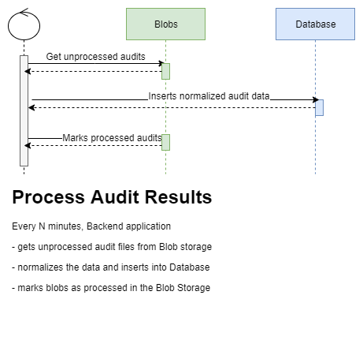
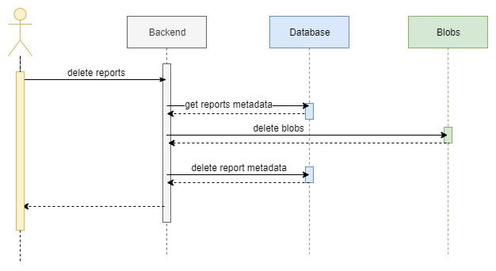

# Joseki Backend

- [Joseki Backend](#joseki-backend)
  - [Scenarious](#scenarious)
    - [Process Audit Results](#process-audit-results)
    - [Get Audit results](#get-audit-results)
      - [Overall infrastructure overview](#overall-infrastructure-overview)
      - [Cloud overview](#cloud-overview)
      - [Cloud diff](#cloud-diff)
      - [Kubernetes overview](#kubernetes-overview)
      - [Kubernetes diff](#kubernetes-diff)
      - [Container Image overview](#container-image-overview)
      - [Check overview](#check-overview)
    - [Tolerate Check Result](#tolerate-check-result)
    - [Reporting scenarios](#reporting-scenarios)
      - [Create Overall report](#create-overall-report)
      - [Create Cloud infrastructure report](#create-cloud-infrastructure-report)
      - [Create Kubernetes cluster report](#create-kubernetes-cluster-report)
      - [List existing reports](#list-existing-reports)
      - [Schedule report](#schedule-report)
      - [Delete reports](#delete-reports)
    - [Create follow-up items](#create-follow-up-items)
  - [Technologies](#technologies)
  - [Runtime](#runtime)
  - [Configuration](#configuration)
  - [Data layer](#data-layer)
    - [Database Data Model](#database-data-model)
    - [Reading audit results](#reading-audit-results)
      - [Processing az-sk results](#processing-az-sk-results)
      - [Processing polaris results](#processing-polaris-results)
      - [Processing trivy results](#processing-trivy-results)
      - [Processing kube-bench results](#processing-kube-bench-results)
    - [Housekeeping Audit Blobs](#housekeeping-audit-blobs)
    - [Persisting generated reports](#persisting-generated-reports)
  - [Inter-process communication](#inter-process-communication)
    - [Frontend API](#frontend-api)
      - [Swagger](#swagger)
    - [Messaging Service](#messaging-service)
      - [Enqueue image scan](#enqueue-image-scan)
  - [Reporting](#reporting)
    - [Report Scheduler](#report-scheduler)
  - [Issue tracking](#issue-tracking)
  - [Supported communication channels](#supported-communication-channels)

At the very first iteration, *Joseki* is focused on Azure and Kubernetes analysis.

## Scenarious

Listed scenarios cover only [V1](/PRODUCTOVERVIEW.md#v1---initial-release) priority items

### Process Audit Results

`Backend` application is responsible for getting latest audit/scan results from **Blob Storage**, normalize these data and inserts into the **Database** optimized for querying.



Implementation details of the process is described in [Reading Audit Results](#reading-audit-results) section.

### Get Audit results

`Backend` application exposes hefty endpoints to query audit result.

#### Overall infrastructure overview

The scenario is used by `frontend` as entry-point to the *Joseki* dashboard. The endpoint returns:

- overall infrastructure score
- score and passed/failed checks per subscription, kubernetes
- history overview of these data

`score` is percentage of succeeded checks.

#### Cloud overview

Cloud Overview gives detailed overview of resources in a single Azure subsription:

- score and count of passed/failed checks
  - history overview of these data
- list of latest check-results
  - check-id
  - resource-id
  - category
  - check-results over last week
- list of check descriptions
  - check-id
  - check description
  - remediation
- links to
  - all other subscriptions overview
  - the same subscription state, but a day/week/month ago

#### Cloud diff

Cloud diff compares the state of the same Azure subscription in two points of time. The result includes:

- score and count of passed/failed checks in `A` and `B`
- list of checks:
  - check-id
  - resource-id
  - category
  - comparison result:
    - present only in `A`
    - present only in `B`
    - the same in both
    - present in both, but with different result

#### Kubernetes overview

Kubernetes Overview gives detailed overview of resources in a single Kubernetes cluster:

- score and count of passed/failed checks
  - history overview of these data
- list of the latest check-results; the list aggregates data from `polaris`, `kube-bench`, `trivy` scanners:
  - check-id
  - resource-id
  - category
  - check-results over last week (trend)
- list of check descriptions
  - check-id
  - check description
  - remediation
- links to
  - all other kubernetes clusters overview
  - the same cluster state, but a day/week/month ago

#### Kubernetes diff

Kubernetes diff compares the state of the same Kubernetes cluster in two points of time. The result includes:

- score and count of passed/failed checks in `A` and `B`
- list of checks:
  - check-id
  - resource-id
  - category
  - comparison result:
    - present only in `A`
    - present only in `B`
    - the same in both
    - present in both, but with different result

#### Container Image overview

Container Image Overview lists found issues and highlights, what resources use the image:

- score and counts of CVEs grouped by severity
  - history overview of these data
- list of CVEs:
  - CVE id
  - severity
  - title and description
  - remediation
  - links with further info
- resources, that use the container image

#### Check overview

Check overview explains the check purpose and lists what resources were evaluated.

- general Check information
  - check-id
  - check description
  - remediation
- counts resources that failed/passed the check
  - history overview of these data
  - links to the same page, but a day/week/month ago
- the current list of resources, that were evaluated

### Tolerate Check Result

Check Result toleration allows to ignore Check Results based on

- check-id
- check category
- resource-id regular expression
- check result

Tolerated check results are excluded from `score` counters and are grayed-out in check-result lists.

Toleration has expiration-date.

### Reporting scenarios

Cloud and Kubernetes reports could be one of two types:

- *Current State* - the state of the system at report-generation time;
- *Diff* - compares current infrastructure state with the previous scheduling point (for daily report compares yesterday and today; for weekly - today with a week ago; and so on)

#### Create Overall report

As starting point, exports to PDF *Overall infrastructure overview*.

#### Create Cloud infrastructure report

As starting point, exports to PDF *Cloud overview* and *Cloud diff* views.

#### Create Kubernetes cluster report

As starting point, exports to PDF *Kubernetes overview* and *Kubernetes diff* views.

#### List existing reports

Returns list of generated reports with short-lived download links.

#### Schedule report

*Joseki* allows to schedule a report and update scheduling configuration later:

- choose report type
- schedule report daily/weekly/monthly
- specify communication channel:
  - email accounts
  - webhook

#### Delete reports

*Joseki* allows to delete a subset of reports. The operation could be triggered from User Interface, by marking a subset of reports with checkboxes and then pressing a delete button for them.

The process involves cleaning up database and deleting report files from **Blob Storage**:



### Create follow-up items

On User Interface a customer could mark a subset of checks and request a creation of follow-up task in external system: Jira, Azure Dev Ops, and others.

The request consists of:

- check result identifiers;
- communication channel type: Jira, Azure Dev Ops, email, webhook, etc;
- communication channel parameters (email addresses, jira ticket parameters, ...).

More details at [Issue Tracking](#issue-tracking) section.

## Technologies

`Backend` is `ASP.NET core 3` application, hosted in docker-container.

The application uses several Azure cloud services:

- The single [Azure PostgreSQL](https://azure.microsoft.com/de-de/services/postgresql/) as **Database**;
- Two [Azure Blob Storages](https://azure.microsoft.com/en-us/services/storage/blobs/) as **Blob Storage** to process audit result and store generated reports;
- The single [Azure Queue Storage](https://azure.microsoft.com/de-de/services/storage/queues/) as **Messaging Service**.

The current choice is based on the most familiar products/framework of the dev-team at the moment of writing.

## Runtime

`Backend` application is expected to run

- as linux docker container;
- in a **single instance** mode. For example, report-generator does not support any leader-election, therefore multiple instances of the app might cause sending duplicate reports.

## Configuration

- `Backend` config should be located at path specified in `CONFIG_FILE_PATH` environment variable path;
- `LOG_FORMAT` - `plain-text` or `json`.

`Backend` configuration file should define which type of **Blob Storage**, **Messaging Service**, and **Database** should be used, credentials/connection strings, and others.

(**TODO:** store sensitive data in secure place insted of file system)

## Data layer

`Backend` application uses two types of data storage: **Blobs** and **Database**:

- one Blob Storage with audit results, which application reads and maintains only reading checkpoints;
- another Blob Storage to store generated reports;
- Database for normalized audit data, configuration files, reports metadata, and others.

### Database Data Model

TBD

### Reading audit results

Audit Result reader is `ASP.NET Core` [Hosted Service](https://docs.microsoft.com/en-us/aspnet/core/fundamentals/host/hosted-services?view=aspnetcore-3.1&tabs=visual-studio) object, which

- wakes up every `N` minutes (`N` is a property in configuration file);
- gets root level containers with metadata from **Blob Storage**;
- invokes proper audit-processor for each container according to scanner type;
  - scanner type is determined based on container name `{scanner-type}-{scanner-short-id}`

Audit-processors - are scanner type specific objects, that:

- read scanner metadata file `{scanner-type}-{scanner-short-id}.meta` and calculate seconds since hearbeat was updated: `DateTime.UtcNow - heartbeat` and do one of the following:
  - if it is more than `heartbeat-periodicity` - log it *warning* level
  - if it is two times more than `heartbeat-periodicity` and more than one hour - log it with *error* level
  - if it is more than a week - add `stale` tag to scanner folder metadata
- get all `{yyyyMMdd-HHmmss}-{hash:7}` containers with audit results that does not have metadata tag `processed` and schedule a Task to process each container. After processing container content, the task should add metadata tag `processed`.

#### Processing az-sk results

TBD

#### Processing polaris results

TBD

#### Processing trivy results

TBD

#### Processing kube-bench results

TBD

### Housekeeping Audit Blobs

Each scanner has a simple task: perform audit and persist the result in a known location, where `Backend` application can access it. The solution is straight-forward but has a major disadvantage - eventually, the blob would be flooded with files. It might cause performance degradation and adds operational complexity - *something* should keep track of processed/unprocessed files to avoid redundant traffic over the network.

Audit Blobs Watchman - is another background process, which takes care of processed files and tries to keep operational space in fit.

It's another `ASP.NET Core` [Hosted Service](https://docs.microsoft.com/en-us/aspnet/core/fundamentals/host/hosted-services?view=aspnetcore-3.1&tabs=visual-studio), which:

- once a day moves *processed* blobs to *archive*;
- once a day moves *stale* scanner folders to *garbage-bin*;
- once a week moves archived blobs to *garbage-bin* after expiring `archive-retention-period`;
- once a week deletes items from *garbage-bin* after expiring `garbage-retention-period`.

The job tries to perform actions at defined in configuration file time: `audit-blobs-watchman.time`.

To track task execution, Audit Blobs Watchman maintains records (one per task type) in `BackgroundJobs` Database Table:

- once the job is started, it checks if records were updated within task-execution period (a day or a week) since `audit-blobs-watchman.time`
- if *true* - sleeps till the next `audit-blobs-watchman.time`
- if *false* - runs the missing tasks
- after task is finished - updates the record with current time

### Persisting generated reports

When `Backend` generates a report, it persists the report in a dedicated **Blob Storage**. Claening up reports from databse and blob is possible only throught regular [Delete Reports](#delete-reports) endpoint.

## Inter-process communication

`Backend` application *communicates* with all other services in a few ways:

- exposes REST API for `Frontend`
- asynchronously reads Audit results from **Blob Storage**
- enqueue image-scan requests to **Messaging Service**

### Frontend API

Communication with `Frontend` web-application happens through REST API over HTTPs. It is implemented with [ASP.NET Web APIs](https://dotnet.microsoft.com/apps/aspnet/apis)

#### Swagger

API is documented using Swagger tool [Swashbunckle](https://docs.microsoft.com/en-us/aspnet/core/tutorials/getting-started-with-swashbuckle) and accessible at `https://{backend-host}:{backend-port}/swagger`.

### Messaging Service

`Backend` uses **Messaging Service** to send image-scan requests to `trivy` scanner. Access to the Messaging Service is abstracted, so adding new implementation is possible. The first implementation uses Azure Queue Storage and `Backend` accesses it throught [official Nuget library](https://docs.microsoft.com/en-us/azure/storage/queues/storage-dotnet-how-to-use-queues).

If message enqueueing failed due transient failure, `Backend` retries the operation 3 times using [exponential backoff](https://en.wikipedia.org/wiki/Exponential_backoff). If all the attempts fail, error-log event is recorded.

#### Enqueue image scan

Image-scan request message envelop consists of two parts: `headers` (system info, like version, tracing data, etc) and `payload` (request details). The initial version is pretty simple, but might be extended later with more data:

```json
{
  "headers": {
    "creation-time": "int",
    "payload-version": "string"
  },
  "payload":{
    "image-tag": "string"
  }
}
```

## Reporting

*Joseki* supports two reporting types:

- One-time report - triggered only one from User Interface;
- Recurring report - configured from User Interface, but scheduling is done periodically and triggered from `Backend` side.

Any generated report has associated metadata in **Database**: creation time, identifier, path in blob-storage, name, etc.

Report file is stored in a dedicated Blob Storage without publicly accessible link. Every time when user wants to download the file, `Backend` does it for him, or generates **temporary download-only link**.

Report scheduling configuration is stored in the `Backend` Database: type of report to generate, frequency, communication-channel information, last-processed date-time.

### Report Scheduler

Report Scheduler is `ASP.NET Core` [Hosted Service](https://docs.microsoft.com/en-us/aspnet/core/fundamentals/host/hosted-services?view=aspnetcore-3.1&tabs=visual-studio) object, which 

- wakes up every hour;
- gets scheduling configuration from the Database;
- invokes report generator for each record, that satisfy the criteria: `LastProcessed < DateTime.UtcNow.AddHours(-ReportFrequency)`;
- set `LastProcessed` to `DateTime.UtcNow`

*Note:* Partial failures and horizontal-scaling are out of scope at the moment. Therefore:

- if the process fails after report is sent, but before `LastProcessed` is updated - user might receive multiple copies of the same report;
- it is not expected to run  multiple instances of `Backend` application.

## Issue tracking

*Joseki* does not track issues itself, but helps to create a follow-up items in external systems: Jira, Azure Dev Ops, Slack, MS Teams, email, webhooks. *Joseki* only invokes communication-channel specific endpoint and pass right parameters to it.

## Supported communication channels

*Joseki* supports sending reports to:

- email
- HTTP webhook
- Jira
- Azure Dev Ops
- Slack
- MS Teams

**Communication channel specific details have to be defined**.
